# Boomi/Azure Hybrid Env Automation - Episode 1: How to Install a Boomi Atom or Molecule on Azure Container Apps Using AVM Bicep Templates

By: **[Jan Daris](https://intersky.nl)**, Intersky Integrations BV  
Contact: [Start Connecting? +31 6 57594183](tel:+31657594183)

---

## Introduction

By leveraging **Azure Container Apps** and **Infrastructure as Code (IaC)** via [Bicep](https://learn.microsoft.com/azure/azure-resource-manager/bicep/), you can deploy a **Boomi Atom or Molecule** in a consistent, repeatable manner. This setup centralizes your integration landscape, ensuring scalability and maintainability.  

In this guide, we’ll demonstrate how to:
- Create an Azure Resource Group
- Provision a Virtual Network (VNet) with subnets for Container Apps and Storage
- Set up a Storage Account (NFS enabled)
- Deploy a Log Analytics Workspace
- Set up a Container Apps Environment
- Launch a Boomi Atom or Molecule as a Container App

This tutorial assumes familiarity with:
- Azure Resource Manager (ARM) or Bicep  
- Containerization basics  
- Boomi Installer Tokens and environment configurations  

For those new to Bicep, check out the [official documentation](https://learn.microsoft.com/azure/azure-resource-manager/bicep/).

---
> **Note** This implementation is an easy example and not something you should deploy to PROD! Make sure to modify the template according your business needs and purpose and make sure to check both Boomi's and Azure's best practises.

## Prerequisites

1. **Azure Subscription**  
   - An active Azure subscription with permissions to create resources (e.g., Owner or Contributor).
2. **Azure CLI or PowerShell**  
   - Install [Azure CLI](https://learn.microsoft.com/cli/azure/install-azure-cli) or  
   - [PowerShell with the Az module](https://learn.microsoft.com/powershell/azure/install-az-ps)
3. **Bicep CLI** (optional)  
   - The [Bicep CLI](https://learn.microsoft.com/azure/azure-resource-manager/bicep/install) can be used locally to compile or validate templates if needed.
4. **Boomi Installer Token & Container Version**  
   - A valid **Boomi Installer Token** that must be refreshed regularly.  
   - The **Boomi Container Version**, e.g., `atom:release`, `molecule:release`, etc.
5. **Boomi Environment ID**  
   - A valid boomi environment ID guid is needed to connect the atom/molceule to a Boomi environment.

---
## High Level Design

```mermaid
architecture-beta
    service dns(logos:aws-route53)[Route 53]
    service cf(logos:aws-cloudfront)[CloudFront]
    service lb(logos:aws-ec2)[Load Balancer]
    service ui(logos:nextjs)[UI]
    service gateway(logos:aws-api-gateway)[API Gateway]
    service auth(logos:aws-lambda)[Auth Service]
    service authDb(logos:aws-dynamodb)[Auth DB]
    auth:R --> L:authDb
    service blog(logos:aws-lambda)[Blog Service]
    service blogDb(logos:aws-dynamodb)[Blog DB]
    blog:R --> L:blogDb
    service analytics(logos:aws-lambda)[Analytics Service]
    service analyticsIndex(logos:aws-open-search)[OpenSearch]
    analytics:R --> L:analyticsIndex
    dns:R --> L:cf
    cf:R --> L:lb
    lb:B --> T:ui
    cf:R --> L:gateway
    gateway:R --> L:auth
    gateway:R --> L:blog
    gateway:R --> L:analytics
```


---
## File Structure

Within this GitHub repository, we have two files:

1. **`main.bicep`**  
2. **`main.parameters.json`**

These files define the entire deployment.


---

## main.bicep

The [`main.bicep`](./main.bicep) file contains all the resources needed to spin up a Boomi Atom or Molecule on Azure Container Apps, including:
- Resource Group creation
- Virtual Network (with AVM module)
- Storage Account setup with NFS shares
- Log Analytics Workspace
- Managed Container Apps Environment
- Boomi Container App deployment

> **Check the code in your GitHub repo** for the full Bicep configuration.

---

## main.parameters.json

The [`main.parameters.json`](./main.parameters.json) file contains the parameter values (e.g., names, IDs, locations, Boomi tokens, etc.) needed to customize your deployment.

> **Remember** to replace placeholder values (e.g., subscription ID, Boomi token) with valid entries before deployment.

---

## Deployment Steps

1. **Sign in to Azure**  
   ```bash
   az login
Select the Azure subscription (if you have multiple)

bash
Copy code
```
az account set --subscription "<Your Subscription ID>"
Validate the Bicep file (optional)
```

bash
Copy code
```
az deployment sub what-if \
  --template-file main.bicep \
  --parameters @main.parameters.json
Deploy
```

bash
Copy code
```
az deployment sub create \
  --name BoomiAtomOrMoleculeDeployment \
  --template-file main.bicep \
  --parameters @main.parameters.json
```

This command will create or update Azure resources (VNet, Storage, Container App Environment, etc.) and deploy the Boomi Atom/Molecule as a Container App.

Verification

Go to the Azure Portal and confirm the new resources in your Resource Group.
Ensure that your Boomi Atom or Molecule is online in the Boomi platform, corresponding to the environment you specified.
Troubleshooting
Invalid or Expired Boomi Token

Refresh your Boomi Installer Token and update the parameter file accordingly.
Networking or Permission Issues

Verify subnet configurations, private endpoints, and IAM roles.
Performance & Scaling

For increased workload, adjust scaleMaxReplicas for a Molecule deployment, ensuring your environment can handle multiple replicas.


Thought for 17 seconds
md
Copy code
# How to Install a Boomi Atom or Molecule on Azure Container Apps Using AVM Bicep Templates

By: **[Jan Daris](https://intersky.nl)**, Intersky Integrations BV  
Contact: [Start Connecting? +31 6 57594183](tel:+31657594183)

---

## Introduction

By leveraging **Azure Container Apps** and **Infrastructure as Code (IaC)** via [Bicep](https://learn.microsoft.com/azure/azure-resource-manager/bicep/), you can deploy a **Boomi Atom or Molecule** in a consistent, repeatable manner. This setup centralizes your integration landscape, ensuring scalability and maintainability.  

In this guide, we’ll demonstrate how to:
- Create an Azure Resource Group
- Provision a Virtual Network (VNet) with subnets for Container Apps and Storage
- Set up a Storage Account (NFS enabled)
- Deploy a Log Analytics Workspace
- Set up a Container Apps Environment
- Launch a Boomi Atom or Molecule as a Container App

This tutorial assumes familiarity with:
- Azure Resource Manager (ARM) or Bicep  
- Containerization basics  
- Boomi Installer Tokens and environment configurations  

For those new to Bicep, check out the [official documentation](https://learn.microsoft.com/azure/azure-resource-manager/bicep/).

---

## Prerequisites

1. **Azure Subscription**  
   - An active Azure subscription with permissions to create resources (e.g., Owner or Contributor).
2. **Azure CLI or PowerShell**  
   - Install [Azure CLI](https://learn.microsoft.com/cli/azure/install-azure-cli) or  
   - [PowerShell with the Az module](https://learn.microsoft.com/powershell/azure/install-az-ps)
3. **Bicep CLI** (optional)  
   - The [Bicep CLI](https://learn.microsoft.com/azure/azure-resource-manager/bicep/install) can be used locally to compile or validate templates if needed.
4. **Boomi Installer Token & Container Version**  
   - A valid **Boomi Installer Token** that must be refreshed regularly.  
   - The **Boomi Container Version**, e.g., `atom:release`, `molecule:release`, etc.

---

## File Structure

Within your GitHub repository, you’ll have two files:

1. **`main.bicep`**  
2. **`main.parameters.json`**

These files define the entire deployment. **You can find them in your repository and reference them directly from there.**

---

## main.bicep

The [`main.bicep`](./main.bicep) file contains all the resources needed to spin up a Boomi Atom or Molecule on Azure Container Apps, including:
- Resource Group creation
- Virtual Network (with AVM module)
- Storage Account setup with NFS shares
- Log Analytics Workspace
- Managed Container Apps Environment
- Boomi Container App deployment

> **Check the code in your GitHub repo** for the full Bicep configuration.

---

## main.parameters.json

The [`main.parameters.json`](./main.parameters.json) file contains the parameter values (e.g., names, IDs, locations, Boomi tokens, etc.) needed to customize your deployment.

> **Remember** to replace placeholder values (e.g., subscription ID, Boomi token) with valid entries before deployment.

---

## Deployment Steps

1. **Sign in to Azure**  
   ```bash
   az login
Select the Azure subscription (if you have multiple)

bash
Copy code
az account set --subscription "<Your Subscription ID>"
Validate the Bicep file (optional)

bash
Copy code
az deployment sub what-if \
  --template-file main.bicep \
  --parameters @main.parameters.json
Deploy

bash
Copy code
az deployment sub create \
  --name BoomiAtomOrMoleculeDeployment \
  --template-file main.bicep \
  --parameters @main.parameters.json
This command will create or update Azure resources (VNet, Storage, Container App Environment, etc.) and deploy the Boomi Atom/Molecule as a Container App.

Verification

Go to the Azure Portal and confirm the new resources in your Resource Group.
Ensure that your Boomi Atom or Molecule is online in the Boomi platform, corresponding to the environment you specified.
Troubleshooting
Invalid or Expired Boomi Token

Refresh your Boomi Installer Token and update the parameter file accordingly.
Networking or Permission Issues

Verify subnet configurations, private endpoints, and IAM roles.
Performance & Scaling

For increased workload, adjust scaleMaxReplicas for a Molecule deployment, ensuring your environment can handle multiple replicas.
About Intersky Integrations BV
At Intersky Integrations BV, we specialize in Integrations and Automation to accelerate digital transformation. We provide an IPaaS (Integration Platform as a Service) approach for:


## Contact

**Questions or ready to start your integration project?**  
[Start Connecting? +31 6 57594183](tel:+31657594183)

**Website**: [https://intersky.nl](https://intersky.nl)  
**Email**: [info@intersky.nl](mailto:info@intersky.nl)

©2024 Intersky Integrations BV | Written by **Jan Daris**
