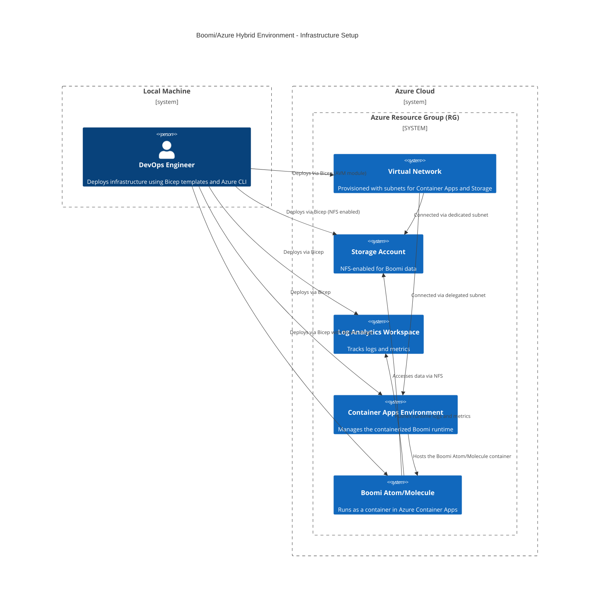

```mermaid
    C4Context
title Boomi/Azure Hybrid Environment - Infrastructure Setup

Boundary(LocalMachine, "Local Machine") {
    Person(DevOps, "DevOps Engineer", "Deploys infrastructure using Bicep templates and Azure CLI")
}

Boundary(Azure, "Azure Cloud") {
    System_Boundary(RG, "Azure Resource Group (RG)") {
        System(VNet, "Virtual Network", "Provisioned with subnets for Container Apps and Storage")
        System(Storage, "Storage Account", "NFS-enabled for Boomi data")
        System(Logs, "Log Analytics Workspace", "Tracks logs and metrics")
        System(ManagedEnv, "Container Apps Environment", "Manages the containerized Boomi runtime")
        System(AtomApp, "Boomi Atom/Molecule", "Runs as a container in Azure Container Apps")
    }
}

Rel(DevOps, VNet, "Deploys via Bicep (AVM module)")
Rel(DevOps, Storage, "Deploys via Bicep (NFS enabled)")
Rel(DevOps, Logs, "Deploys via Bicep")
Rel(DevOps, ManagedEnv, "Deploys via Bicep")
Rel(DevOps, AtomApp, "Deploys via Bicep with Boomi image")
Rel(VNet, Storage, "Connected via dedicated subnet")
Rel(VNet, ManagedEnv, "Connected via delegated subnet")
Rel(ManagedEnv, AtomApp, "Hosts the Boomi Atom/Molecule container")
Rel(AtomApp, Storage, "Accesses data via NFS")
Rel(AtomApp, Logs, "Pushes runtime logs and metrics")
```